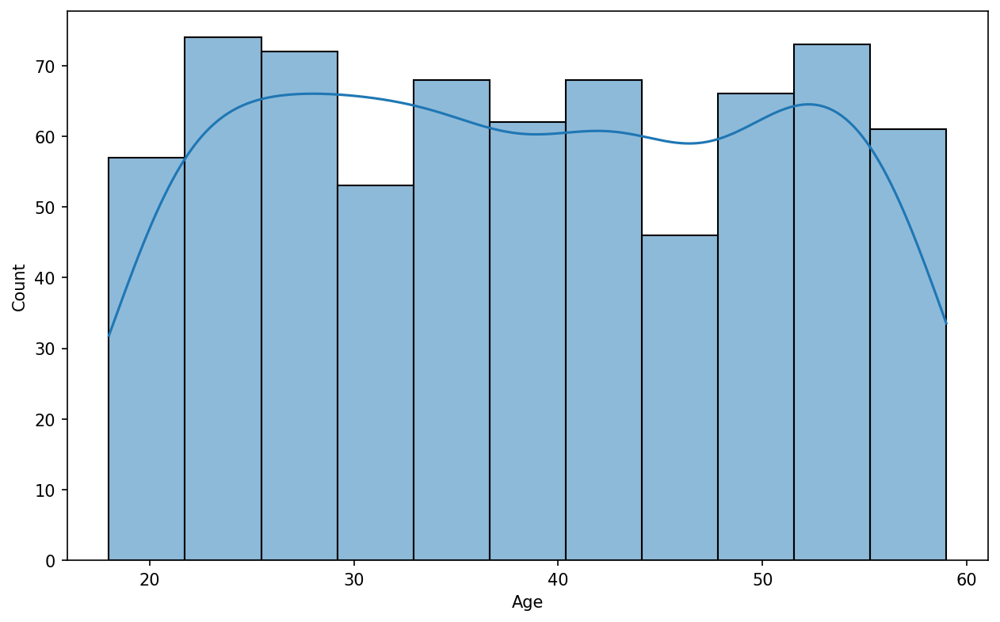
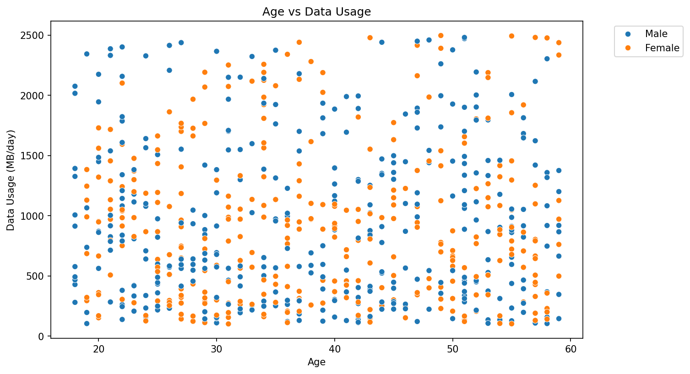

# **Behavioral Analysis of User Phone Usage Metrics (ML)**

Created in Google Colab.

**Dataset Source**: [Kaggle - California Housuing Prices](https://www.kaggle.com/datasets/valakhorasani/mobile-device-usage-and-user-behavior-dataset)

### **Overview**
This project conducts a behavioral analysis on user phone usage metrics. The objective is to identify correlations between various phone usage metrics and user behavior.

### **Dataset Summary**
- **Sample Size**: 700 entries (n = 700)

- **Features**:
  - **User ID**: Unique identifier for each user. 
  - **Device Model**: Model of the user's smartphone. 
  - **Operating System**: OS of the device (iOS or Android). 
  - **App Usage Time**: Daily time spent on mobile applications, measured in minutes. 
  - **Screen On Time**: Average hours per day the screen is active. 
  - **Battery Drain**: Daily battery consumption in mAh. 
  - **Number of Apps Installed**: Total apps available on the device. 
  - **Data Usage**: Daily mobile data consumption in megabytes. 
  - **Age**: Age of the user. 
  - **Gender**: Gender of the user (Male or Female). 
  - **User Behavior Class**: Classification of user behavior based on usage patterns from Light (1) to Extreme (5) usage.

  The data was divided into four clusters, each representing a different level of device usage. The clusters are color-coded in the visualizations as follows:

- **Cluster 0**: Light Users (Light Purple)
  - **App Usage Time**: < 200 minutes/day
  - **Battery Drain**: < 500 mAh/day
  - **Screen On Time**: < 2 hours/day
  - **Data Usage**: < 500 MB/day
  - **Characteristics**: Light users who engage with their devices minimally, likely for simple tasks like messaging or checking emails.
- **Cluster 1**: Moderate Users (Pink)
  - **App Usage Time**: 200-400 minutes/day
  - **Battery Drain**: 500-1000 mAh/day
  - **Screen On Time**: 4-6 hours/day
  - **Data Usage**: 500 MB - 1 GB/day
  - **Characteristics**: Users who engage in moderate device use, likely for social media, browsing, and casual streaming.
- **Cluster 2**: Heavy Users (Darker Purple)
  - **App Usage Time**: 400-600 minutes/day
  - **Battery Drain**: 1000-2000 mAh/day
  - **Screen On Time**: 6-10 hours/day
  - **Data Usage**: 1 GB - 2 GB/day
  - **Characteristics**: Heavy users who engage in activities such as frequent video consumption, online gaming, or multitasking.
- **Cluster 3**: Power Users (Darkest Purple)
  - **App Usage Time**: > 600 minutes/day
  - **Battery Drain**: > 2000 mAh/day
  - **Screen On Time**: > 10 hours/day
  - **Data Usage**: > 2 GB/day
  - **Characteristics**: Power users with extreme reliance on their devices, likely for work, streaming, or gaming. They exhibit the highest battery drain and data usage.

### **Analysis and Models**
1. **Logistic Regression Model**:
   - Predicts **Battery Drain (mAh/day)**.
   - Trained using **App Usage Time (min/day)**, **Screen On Time (hours/day)**, and **Data Usage (MB/day)**.

2. **Linear Regression Model**:
   - Developed as a comparison to the logistic regression model for predicting battery drain and examining model performance.
  
A histogram is done to visualize distribution of ages.

A scatterplot is done to see if there is any correrlation between age and number of apps installed.

A boxplot is used to visualzie the distributuion between genders.

A correlation matrix is done to visuzlie realtionships between data points.

This scatter plot visualizes the relationship between age and app usage.

This scatter plot visualizes the relationship between age and data usage.

Distribution of device models are done to validate data set.

Distribution of device models are done to validate data set.

Distribution of device models are done to validate data set.

Clear categorizational differnces can be observed.

A predicted vs actual battery drain graph is created to visualize if the predicted battery drain is accurate.

  
### **Machine Learning Anaylsis**

The logistic regression model includes several measurments from the function metrics.

Classification Report:
Precision:
Recall:
f1-score:
Support:

Regression Evaluation Metrics:

Mean Absolute Error (MAE): 174.55026780066294

Mean Squared Error (MSE): 44964.39113330613

### **Machine Learning Anaylsis**

Root Mean Squared Error (RMSE): 212.04808684189098

R-squared (R²): 0.9328915642805237
