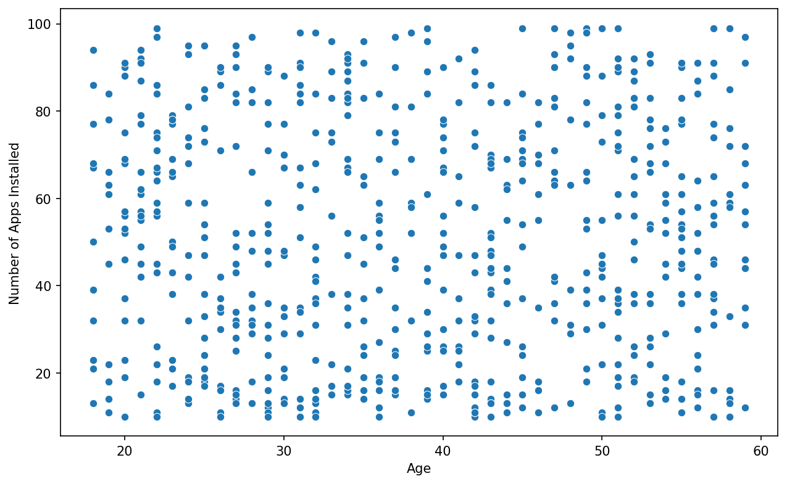
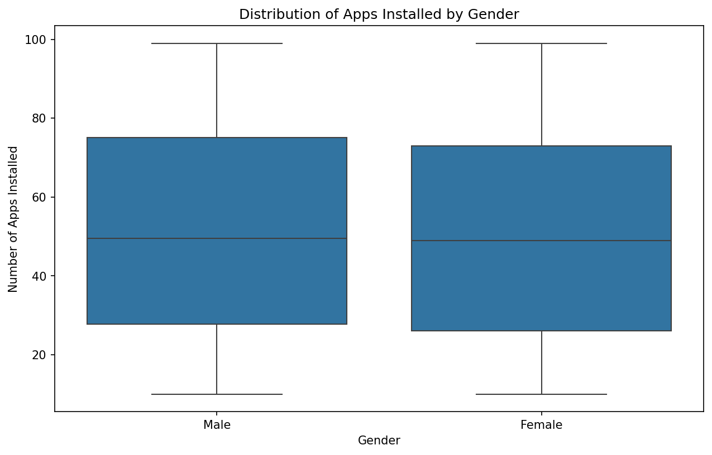
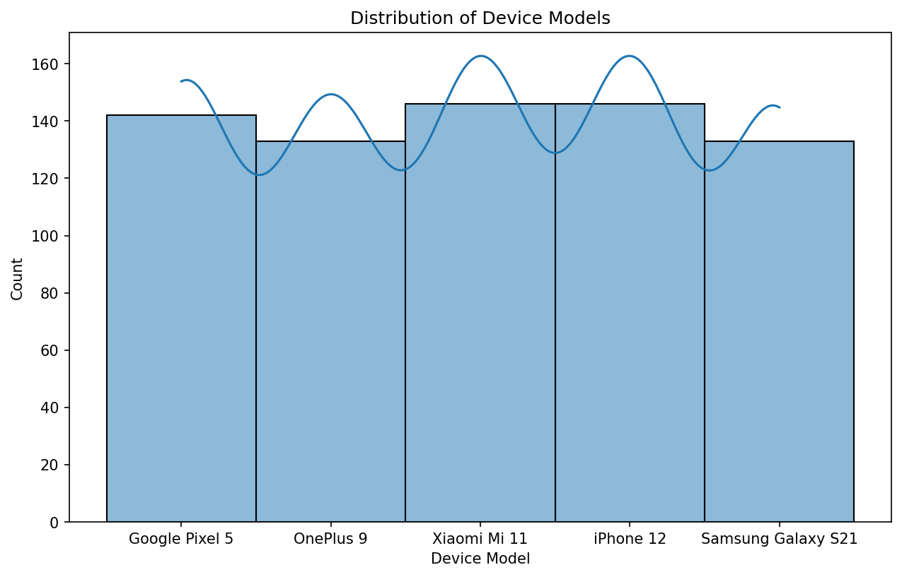
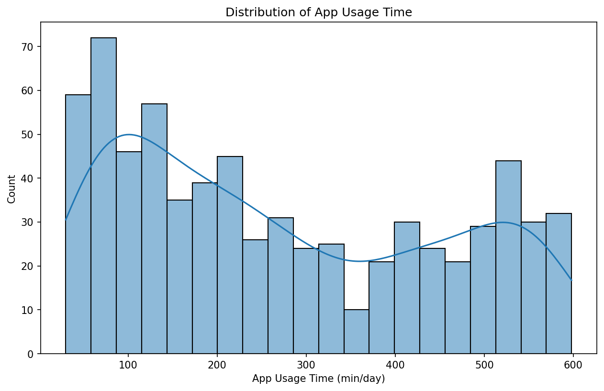
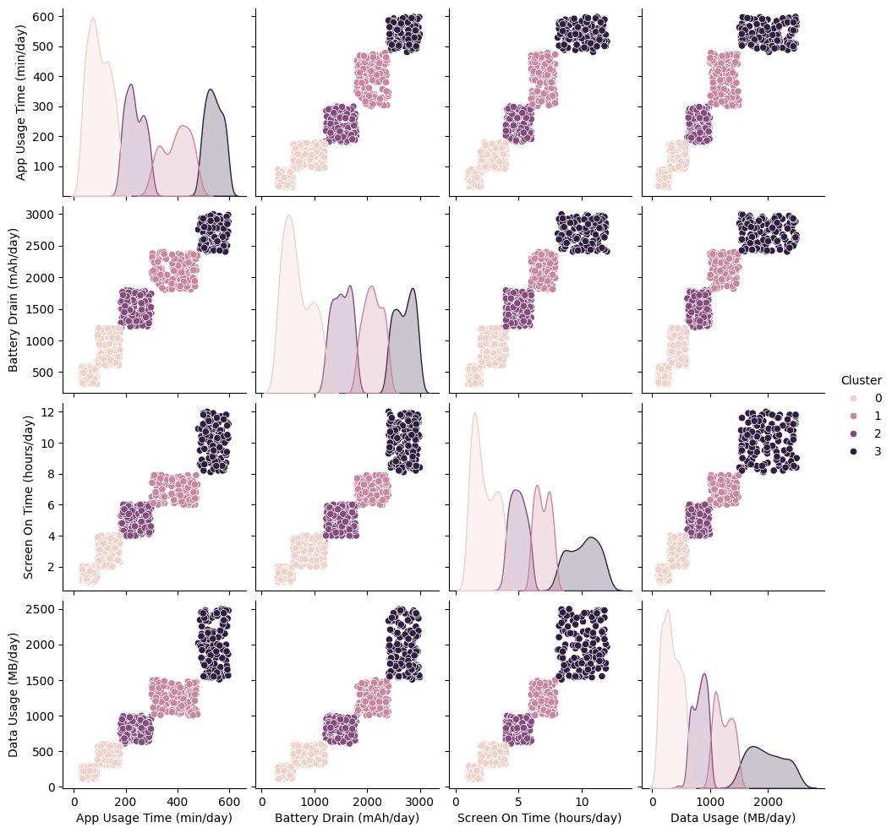
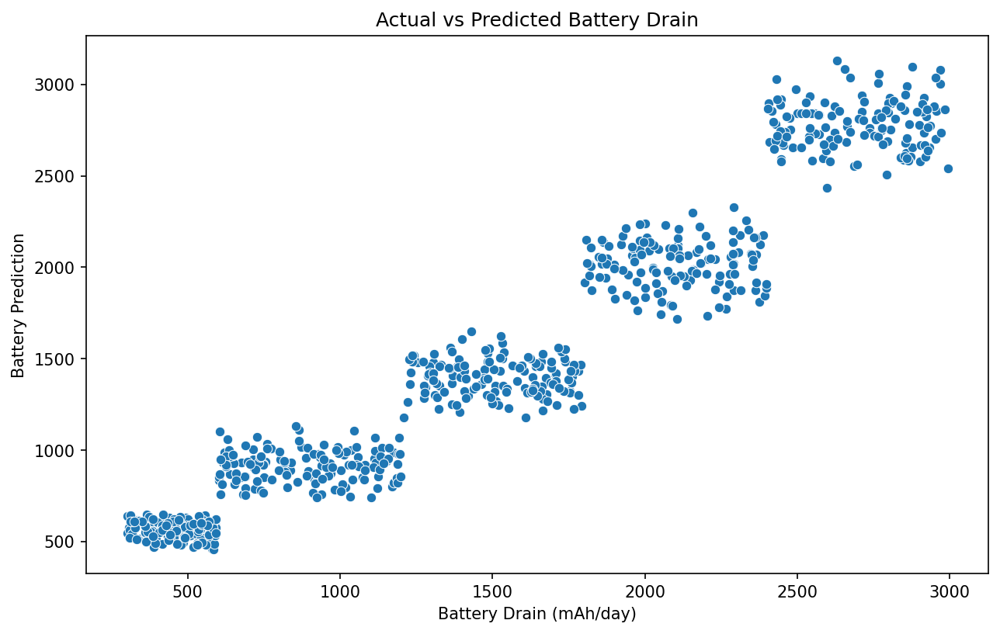

# **Behavioral Analysis of User Phone Usage Metrics (ML)**

Created in Google Colab.

**Dataset Source**: [Kaggle - Mobile Device Usage and User Behavior Dataset](https://www.kaggle.com/datasets/valakhorasani/mobile-device-usage-and-user-behavior-dataset)

### **Overview**
---
This project conducts a behavioral analysis on user phone usage metrics. The objective is to identify correlations between various phone usage metrics and user behavior.

### **Dataset Summary**
---

- *This dataset provides a comprehensive analysis of mobile device usage patterns and user behavior classification. It contains 700 samples of user data, including metrics such as app usage time, screen-on time, battery drain, and data consumption. Each entry is categorized into one of five user behavior classes, ranging from light to extreme usage, allowing for insightful analysis and modeling. This dataset is ideal for researchers, data scientists, and analysts interested in understanding mobile user behavior and developing predictive models in the realm of mobile technology and applications. This Dataset was primarily designed to implement machine learning algorithms and is not a reliable source for a paper or article.*

- **Sample Size**: 700 entries (n = 700)
  
- ***Balanced Sample Set***

- **Features**:
  - **User ID**: Unique identifier for each user. 
  - **Device Model**: Model of the user's smartphone. 
  - **Operating System**: OS of the device (iOS or Android). 
  - **App Usage Time**: Daily time spent on mobile applications, measured in minutes. 
  - **Screen On Time**: Average hours per day the screen is active. 
  - **Battery Drain**: Daily battery consumption in mAh. 
  - **Number of Apps Installed**: Total apps available on the device. 
  - **Data Usage**: Daily mobile data consumption in megabytes. 
  - **Age**: Age of the user. 
  - **Gender**: Gender of the user (Male or Female). 
  - **User Behavior Class**: Classification of user behavior based on usage patterns from Light (1) to Extreme (5) usage.

  The data was divided into four clusters, each representing a different level of device usage. The clusters are color-coded in the visualizations as follows:

- **Cluster 0**: Light Users (Light Purple)
  - **App Usage Time**: < 200 minutes/day
  - **Battery Drain**: < 500 mAh/day
  - **Screen On Time**: < 2 hours/day
  - **Data Usage**: < 500 MB/day
  - **Characteristics**: Light users who engage with their devices minimally, likely for simple tasks like messaging or checking emails.
- **Cluster 1**: Moderate Users (Pink)
  - **App Usage Time**: 200-400 minutes/day
  - **Battery Drain**: 500-1000 mAh/day
  - **Screen On Time**: 4-6 hours/day
  - **Data Usage**: 500 MB - 1 GB/day
  - **Characteristics**: Users who engage in moderate device use, likely for social media, browsing, and casual streaming.
- **Cluster 2**: Heavy Users (Darker Purple)
  - **App Usage Time**: 400-600 minutes/day
  - **Battery Drain**: 1000-2000 mAh/day
  - **Screen On Time**: 6-10 hours/day
  - **Data Usage**: 1 GB - 2 GB/day
  - **Characteristics**: Heavy users who engage in activities such as frequent video consumption, online gaming, or multitasking.
- **Cluster 3**: Power Users (Darkest Purple)
  - **App Usage Time**: > 600 minutes/day
  - **Battery Drain**: > 2000 mAh/day
  - **Screen On Time**: > 10 hours/day
  - **Data Usage**: > 2 GB/day
  - **Characteristics**: Power users with extreme reliance on their devices, likely for work, streaming, or gaming. They exhibit the highest battery drain and data usage.

### **Analysis and Models**

This section outlines the implementation and insights derived from the two primary models: Logistic Regression and Linear Regression. These models were designed to explore and predict user behavior and device metrics effectively.

---

#### **1. Logistic Regression Model**
The Logistic Regression model was employed to classify user behavior into distinct categories based on their phone usage patterns. The primary goal was to predict the **User Behavior Class** (ranging from Light to Extreme usage) using a combination of key features: 

- **App Usage Time (min/day)**
- **Screen On Time (hours/day)**
- **Data Usage (MB/day)**

**Steps for Implementation:**
- The dataset was split into training and testing sets using an 80-20 ratio with the **train_test_split** function.
- Data was standardized using **StandardScaler** to normalize features for better model performance.
- A Logistic Regression model was trained using the scaled data, with a maximum iteration limit of 500 to ensure convergence.
- The model was evaluated on the testing set, yielding the following metrics:
  - **Precision, Recall, and F1-Score**: Demonstrated perfect classification performance across all classes.
  - **Confusion Matrix**: Showed no misclassifications, underscoring the model's reliability.

This model's results highlight its effectiveness in identifying user behavior classes based on a combination of usage metrics.

---

#### **2. Linear Regression Model**
The Linear Regression model was developed to predict **Battery Drain (mAh/day)**, a continuous variable influenced by several usage metrics. This model served as a complementary analysis to understand the relationships between battery consumption and other features.

**Steps for Implementation:**
- The features used for training were:
  - **App Usage Time (min/day)**
  - **Screen On Time (hours/day)**
  - **Data Usage (MB/day)**
- The model was trained on the dataset without feature scaling, as linear regression is less sensitive to scaling compared to logistic regression.
- Predictions for battery drain were generated and stored in a new column, **Battery Prediction**.

**Performance Evaluation:**
- The model's fit was assessed using key regression metrics:
  - **R² (R-squared):** Achieved an excellent score of 0.932, indicating that the model explains 93.2% of the variance in battery drain.
  - **Mean Absolute Error (MAE):** 174.550, showing that the average prediction error is within a reasonable range.
  - **Root Mean Squared Error (RMSE):** 212.048, further supporting the model's accuracy in predicting battery consumption.

**Insights:**
- The high R² value demonstrates that battery consumption is strongly influenced by app usage time, screen-on time, and data usage.
- This model offers practical applications, such as estimating battery drain for optimizing device performance or providing user insights on energy consumption.

---

### **Combined Analysis**
Both models complement each other in understanding mobile device usage patterns:
- The Logistic Regression model provides categorical insights, effectively classifying user behavior into meaningful segments.
- The Linear Regression model quantifies the continuous impact of usage metrics, offering precise predictions for battery consumption.

These models together create a comprehensive framework for analyzing and predicting mobile device usage patterns and their impact on user behavior and battery performance. 

A histogram is done to visualize distribution of ages which shows equal distribution.

A scatterplot is done to see if there is any correrlation between age and number of apps installed. No correlation is visualized.

A boxplot is used to visualzie the distributuion between genders which shows near equal distribution.

A correlation matrix is made to better understand the relationship between variables. Strong positive correlations are evident between variables like App Usage Time, Screen On Time, Battery Drain, Number of Apps Installed, and Data Usage, with coefficients close to or above 0.95. This suggests that increased app usage time is highly associated with increased screen-on time, battery consumption, and data usage, as well as a higher number of installed apps. Conversely, the variable Age shows negligible correlation with most other variables, implying that mobile usage patterns are not significantly dependent on the user's age. Lastly, the User Behavior Class is strongly correlated (above 0.97) with all usage-related metrics, highlighting its potential reliance on these factors for classification. 

This scatter plot visualizes the relationship between age and app usage. No correlation is visualized.

This scatter plot visualizes the relationship between age and data usage. Data usage is seen to be universally independent of age.

Distribution of device models are done to validate data set. A near equal distribution is visualized.

A histogram is done to show app usage time. App usage time is right-skewed.

A box plot is done to visualize the user behavior classes.

Clear categorizational differnces can be observed.

A predicted vs actual battery drain graph is created to visualize if the predicted battery drain is accurate.

### **Machine Learning Anaylsis**

The logistic regression model includes several measurments from the function metrics.

###  Classification Report:

**Precision:** 1.00

**Recall:** 1.00

**F1-score:** 1.00

**Support:** 110

### Regression Evaluation Metrics:

**Mean Absolute Error (MAE):** 174.550

**Mean Squared Error (MSE):** 44964.391

**Root Mean Squared Error (RMSE):** 212.048

**R-squared (R²):** 0.932

The regression model’s performance is highly commendable, with an R-squared (R²) value of 0.932, indicating that the model explains 93.2% of the variance in the dependent variable. This level of accuracy demonstrates that the linear regression model is well-suited for the data and can reliably predict battery drain based on the given independent variables. The R² score effectively highlights the model's overall performance, while the Mean Absolute Error (MAE) of 174.550 and Root Mean Squared Error (RMSE) of 212.048 are within an acceptable range.

### Conclusion:

This project successfully conducted a behavioral analysis of user phone usage metrics and demonstrated the effectiveness of machine learning models in predicting user behavior. App usage time, screen-on time, battery drain, and data consumption exhibit high interdependence, emphasizing their role in understanding user behavior. Age has a negligible correlation with other usage metrics, highlighting the universality of mobile behavior patterns across age groups. Clear distinctions among user behavior classes reinforce the validity of the categorization and provide a robust framework for behavioral segmentation.

Machine learning models performed exceptionally well. The Logistic Regression Model achieved perfect precision, recall, and F1 scores, showcasing its robustness in classification tasks. The Linear Regression Model achieved an R² value of 0.932, indicating high predictive accuracy for battery drain. Metrics like MAE and RMSE were within acceptable ranges, underscoring the model’s reliability.
